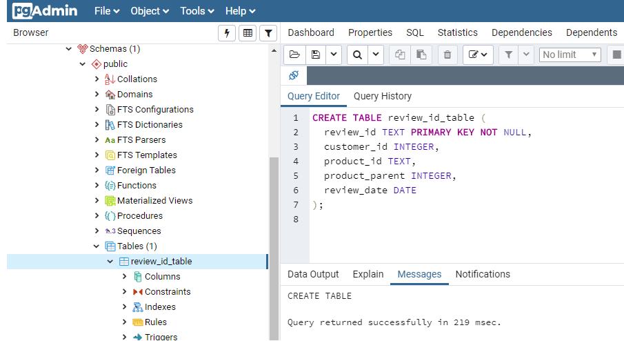
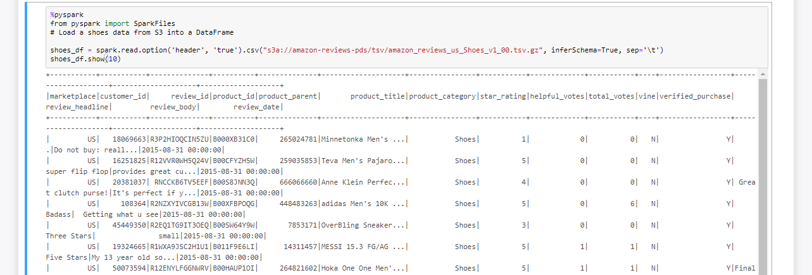
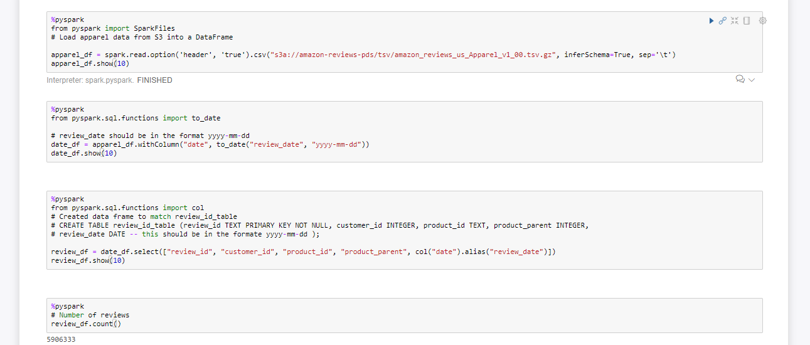

# Amazon's Vine Program - Big Data Assignment

## Background

Many of Amazon's shoppers depend on product reviews to make a purchase. Amazon makes 
these datasets publicly available. However, they are quite large and can exceed the 
capacity of local machines to handle. 

## Goals

1. Performing an ETL process in the cloud and upload the created data frames to 
an Amazon RDS instance, to match production-ready tables from two Amazon customer 
review datasets.

2. Using SQL to perform a statistical analysis of selected data and to analyze whether 
reviews from Amazon's Vine Program are trustworthy.

## Results

### Level 1

* Tables in the RDS database using this [script](./Scripts/schema.sql). Example:
 
 

* ZEPL notebooks, the chosen data sets were `Shoes` and `Apparel`. 
The data sets can be found [here](https://s3.amazonaws.com/amazon-reviews-pds/tsv/index.txt).

These notebooks were used to:

  - __Extract__ one data set per notebook and counting the number of records (rows) in the dataset.

  - __Transform__ each data set to fit the tables created, considering the data types and column names.

  - __Load__ the data frames to the tables into the RDS instance. 

  The content of the ZEPL notebooks was copied into these [Jupyter Notebooks](./Notebooks/).

### Level 2 

* SQL queries to analyze the data can be found [here](./Scripts/stats.sql) and 
 the views created can be found [here](./Scripts/views.sql).

* A [summary](./Summary/BigData_Summary.pdf) of the findings and analysis.

